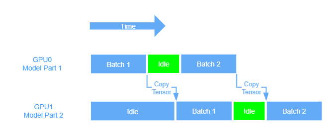
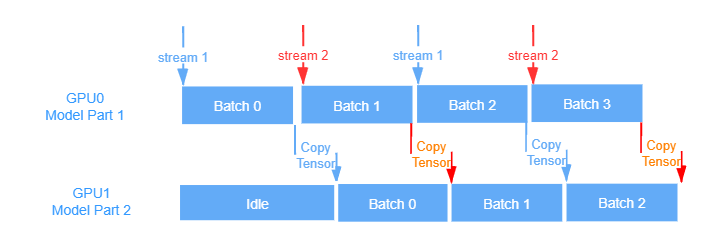

## 实验
现在的 resnetv2.py 比 torchvision.py 的慢的多，而且显存占多一倍。但是代码逻辑都是一样的，需要寻找原因。  
原因是 resnetv2.py ResNet 的 forward 返回了中间层的问题。但是为什么返回中间层会降低效率？中间层并未接入 Loss?  
这是个乌龙，resnetv2 的 ResNet block 少了个 maxpool，不是中间层的问题。

4 卡 16 worker 256 batch_size 一个 epoch 约 800s，再增加 batch_size 时间节约幅度减小，到 512 才 770s。
猜测原因
 * 磁盘 io 达到瓶颈，从日志中可以看到，256 的时候总时间:数据读取约 4:1，数据读取时间方差小，范围 0.029~0.044s，
 512 的时候比值约 3:1，数据读取的时间在 batch 之间浮动较大，0.020s~0.109s 不等。
确认上面的原因需要进一步学习分布式多进程的原理。

## 分布式多进程
[单机多卡最佳实践](https://pytorch.org/tutorials/intermediate/model_parallel_tutorial.html)。DDP 教程在[这里](https://pytorch.org/tutorials/intermediate/ddp_tutorial.html)。用分布式多进程做 ImageNet+ResNet 训练有[官方样例](https://github.com/pytorch/examples/blob/master/imagenet/main.py)，但官方样例的 test 没做分布式 [issue#461](https://github.com/pytorch/examples/issues/461)，我把它改成了[分布式](https://github.com/triomino/examples/blob/master/imagenet/main.py)。做一些笔记：
### model parallel 比 model share 更快。
model parallel 指模型分割。
model share 只是数据分割，所有 GPU 共享同样的 model 参数。也就是 DataParallel 和 DistributedDataParallel 做的事情。
尽量用 DistributedDataParallel，DDP 多进程，DP 多线程。DistributedDataParallel 还有个好处是可以
和 model parallel 融合。
model parallel 具有更高的编程复杂度，但是感觉会很爽。
### model parallel and pipeline
我们把 model 按层分割成两部分，那么单个 GPU 训练过程如下图：
  
[这里](https://pytorch.org/tutorials/intermediate/model_parallel_tutorial.html) 给了双 GPU pipeline 的例子.  
数据 stream 从 GPU0 输入，输出送到 GPU1，这样把 GPU 串联起来。batch0 在 GPU1 上跑第二层的时候，batch1 可以进 GPU0 跑第一层了。这样就并行了起来，pytorch 调度 CUDA 是异步的，所以不用写多线程代码。图示：  
  

这里会有额外时间耗费，比如从 GPU0 copy 到 GPU1，拷贝需要时间. 同时，如果只有一个 stream，那你在 copy 到 GPU1 的时候 GPU0 是不能动的，因为拷贝是同步函数，这时 GPU0 空闲，就是上面绿色的地方。

事实上这两个过程可以同时进行，冲突仅仅是因为我们只有一个 stream。如果开两个 stream，在 batch0 拷贝的时候，stream2 可以开始算 batch1，然后 steam2 拷贝 batch1 的时候，第一个 stream 可以开始算 batch2，这样交错就减少了空闲时间，上图的绿色部分就能压调了. 参考下图：  

另外，一般拷贝比计算慢得多，所以两个 stream 就够了，如果拷贝比计算快，stream 可以更多，取决于两者的比值。

由于拷贝是同步的，所以要开 multiprocessing 同时进行两个拷贝过程. 以上这些都要自己手编，没有现成模块。
### DDP 原理
在 constructor, forward 和 backward 分别有一个同步点，把所有计算后的参数同步(reduce)。
### DDP 和 save/load
假设我们的进程开始会 load，结束要 save. 显然应该只在一个 process 上写，其他同步。可以用 distributed.barrier() 保证读写的安全性。此外，根据[读写教程](https://pytorch.org/tutorials/beginner/saving_loading_models.html)，如果存的时候没有 model.module.state_dict() 中的 module，可能写入会带 device 信息，[DDP教程](https://pytorch.org/tutorials/intermediate/ddp_tutorial.html)里给的代码是在 load 的时候用 map_location 把 cuda0 变成 cudax. 我觉得两个应该都行，如果带不带 module 的区别仅仅是 device 信息有无。其实这是小问题，如果你有洁癖，直接自己规定什么东西要 save，像 [imagenet 样例程序](https://github.com/pytorch/examples/blob/master/imagenet/main.py) 一样
### DDP 和 model parallel 融合
比如启动四个 process，每个 process 把 model 分割成两个，一共要用 8 个 GPU.
0,2,4,6 同步前半个 model 的参数，1,3,5,7 同步后半个。 stream 来的时候分四流0->1,2->3,4->5,6->7，为了节约拷贝时间可以分八流，两两交错。代码在[DDP教程](https://pytorch.org/tutorials/intermediate/ddp_tutorial.html)最后一节。这可能就是极致的并行。有空玩一玩这个，看上去非常酷炫。
### 问题
怎么找分割点？我猜可以实验看时间。这样 forward 和 backward 还得分开搞，不是很麻烦？
### 其他链接
[DDP 内部实现](https://pytorch.org/docs/stable/notes/ddp.html#ddp)  
[DDP 接口文档](https://pytorch.org/docs/stable/nn.html#torch.nn.parallel.DistributedDataParallel)