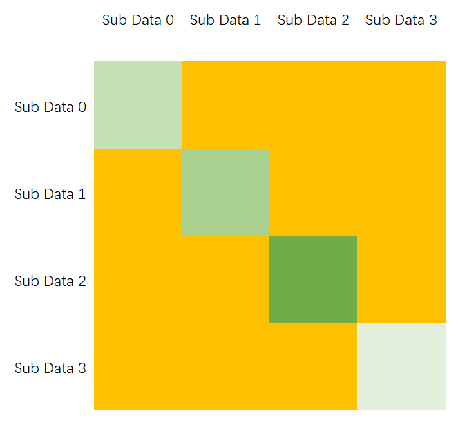
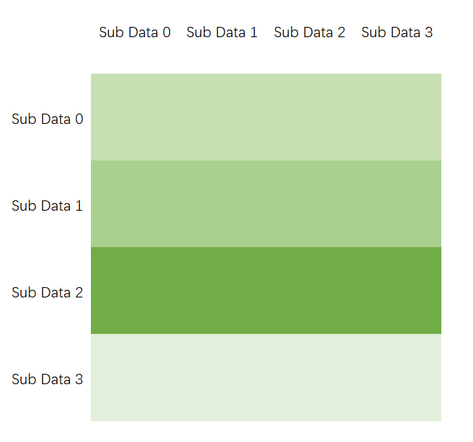
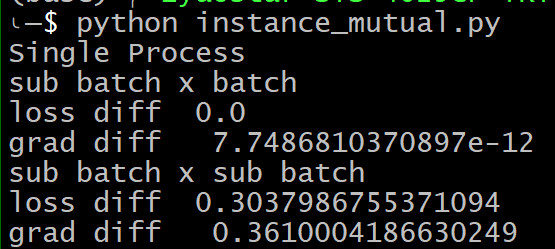

## 问题发现
Data Parallel 的时候想到一个很严重的问题。如果是样本之间的关系算 Loss，其实不好 backward. 初步想法是汇总各个 GPU 上的 sub-batch 得到 batch 然后 sub-batch x batch 是相似矩阵的一部分，一定要记得 no shuffle 来测试是不是和单卡行为一致。如果搞不出来或者效率很低去查查资料。

## 问题说明
假设我们一个 batch 的 loss 是这样的 $L(\mathcal X)=\frac{1}{n^2}\sum{\|
x_i-x_j\|_p}$，forward 是照着公式这么写的。  
然后我们要把他送去 4 个 GPU 做 Data Parallel. 按照 torch.distributed 的逻辑，batch 分割成了 4 个 sub-batch，然后送到 4 个进程分别训练，forward 完成时同步一次，backward 完成时同步一次。  
这个逻辑对于一阶的 forward 过程是正确的。但是对于刚刚这个 loss 会出问题。  
不把 batch 分开时，整个 batch 算的距离和用下图整个大正方形面积表示：

  

但是按照分布式四个 GPU 自顾自算 $L(\mathcal X_i)(i=0,1,2,3)$ 算出来的结果是上图绿色部分。

## 如何解决
这个问题不难解决，[举例代码](instance_mutual.py)也已经写好了。其中 `MutualLossDistributed` 类就用来解决上面说明的问题。forward 的时候，我们额外传进去整个 batch，然后算一整行长方形的 Loss，如下图所示：  

为了适应原来的框架，每个利用样本之间关系的方法需要另外写一个 Distributed 的类，它的 forward 接受 sub-batch 和整个 batch

## Demo
[Demo 代码](instance_mutual.py)   
这个程序会跑三段代码，一个是单卡，另外两个是上面两种实现。给三个实现输入同一个 batch，对比算出来的 loss 和梯度。结果如下：  

sub batch x sub batch 是有问题的实现，sub batch x batch 是正确实现。loss diff 和 grad diff 分别是与单卡比 loss 和梯度的误差。

## 可能存在的问题
1. 训练速度降低
2. 显存过大

## 它可能不是一个问题
和学长讨论之后，这个行为等同于单卡同时对一堆 batch 做 backward，既不是单卡用小 batch 依次跑，也不是单卡一下子做完一个大 batch。不过并不是没有道理的，先做实验看 acc 是不是真的受到了影响。希望找到一些论文来支撑这种做法的正确性。

## 它可能被研究过
忽然在 Accurate, Large Minibatch SGD: Training ImageNet in 1 Hour 中看到 batch normalization. 这个层要用 batch 的统计数据，那分布式的时候咋办？所以肯定被研究过了。这篇的 2.3 节就是干脆用 sub-batch 的统计数据，然后调一调 learning rate 就行了。

pytorch 官方肯定会对 BN 做考虑，去看一看。网上又查到了这篇。 Batch Renormalization: Towards Reducing Minibatch Dependence in Batch-Normalized Models. Tensorflow 里有个相关 [issue](https://github.com/tensorflow/tensorflow/issues/7439), pytorch 里也有 [issue](https://github.com/torch/nn/issues/1071)。