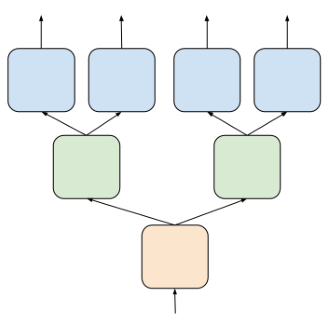

## (14NIPSworkshop) Distilling the Knowledge in a Neural Network
一些直觉：
 * 复杂模型很多多出来的信息，比如远远低于标签分数的类分数。这些信息被浪费了。
 * 从复杂模型学过来的简单模型是对直接学做 regularization，效果会好于直接训练简单模型。

### Temperature
$q_j=\frac{e^{z_j/T}}{\sum_i{e^{z_i/T}}}$
训 Teacher 的时候 $T=T_0$ 设的很大。训 student 时，目标函数分两部分：在 $T=T_0$ 下 teacher 和 student 的 soft targets 交叉熵，和在 $T=1$ 下 student 和标签的交叉熵。因为产生的梯度是 $1/T$ 规模，后面一部分分配 $1/T_0^2$ 的权重，当然这个权重是可调的。

T=1 也就是一般的 softmax loss 和 label 很接近。增加 Temperature 让 Loss 增加对那些低类别分数的关注，所以高 Temperature 是在尽可能保留 T=1 时丢失的那些信息。但是 student 非常简单的时候 Temperature 得降低，以减少这些低类别分数的信息比例。

### ensumble of specialists
specialist: 专门在难以分辨的类（用聚类之类的手段决定哪些类很接近）之间做分类，其他类归为一个 dustbin class 为了防止过拟合，用原来模型的参数初始化，并调节 dustbin 样例比例。预测的时候，先用原模型得到最可能的k类，和这些类有交的 specialists 被拿来和原模型一起算 Loss。显然 specialists 可以并行蒸馏。

### soft targets as regularization
teacher 算出来的 probability distribution, hard targets 指 label distribution. hard targets 更容易过拟合，soft targets 中低类别分数信息更丰富，所以可以看作一种 regularization 手段。

### review
关键是用 soft target 算 loss，这是一种 regularization，文章也解释了为什么，是更好地利用了低分的隐藏的信息，下一篇文章说这个隐藏信息指高低分数的差距。specialists 是一个很有意思的想法。

### 延伸
softmax 顾名思义，是 soft 的 max, 直接找最大值是 hard max，就是 labels，向量里只有一个 1 其余都是 0. softmax 是按照概率选一个最大值出来。temperature -> 0 就是 hard max, -> $\infty$ 就是平均.   
我们要调整概率平均一些而非 one-hot 的原因是 soft 之后 =0 的梯度很小，传播不回去，网络没法迭代。

## (15ICLR-FitNets) FITNETS: HINTS FOR THIN DEEP NETS
加了中间层 Loss. 由于 hint(teacher) 和 guide(student) 维数不等，给 guide 套了一层对齐的 CNN 再和 hint 求 distance。（用 FC 对齐参数太多了）  
训练的时候先训到 guide 为止的参数，然后这些作为初始化做 KD。

有了中间层约束，student 可以 thin and deep. 直接训 deep and thin 是不好的。结果 student 参数比 teacher 少的同时效果更好。

这篇文章对上一篇的 soft loss 做了进一步的解释，认为 teacher 和 student 的 soft targets 交叉熵增加了 easy sample 的权重，所以效果更好。因为你从 labels 看不出分类之间的差距，soft targets 则反映了差距信息，类别分数差距越大的 sample(easier sample) 越容易分辨，权重就越高。

### review
hint/guide 训出来只拿来初始化有点浪费？为什么不把 Loss 合进 KD 的 Loss 一起做？这个方法是不是可以 apply 到多层 hint/guide？  
从实验看出，初始化在更深的网络里非常重要。因为高度非凸和非线性/local minimal 难以捉摸？

## (19CVPR-IRG)Knowledge Distillation via Instance Relationship Graph
直觉：实例特征之间的关系比特征本身更 robust. 两个复杂网络的特征可能千差万别，但是同一个类内的实例特征距离接近。因此 teacher 和 student 不同结构时应当考虑特征之间的距离。
### Problem
不重要：moderate 的准确含义。IRG 看起来是个很通用的 idea，有没有其他地方用到？IRG 用的全是 L2 距离，能不能变成 softmax + cross entropy？到底用 logits 还是 soft targets 算 loss？  
需要解决的问题：teacher 和 student 特征维数不同，怎么算距离，3.2 说只有 logits 层这么干，那意味着中间层的 $L_{IRG}$ 都只有距离矩阵？one to many 是怎么一回事？比如只考虑距离矩阵，是一个矩阵和多个矩阵的差的和？从实验描述看这个可能性大一点。
中间层怎么选取？one-to-many 并没有给出如何选择指导层的策略？实验中有中间层选取，但是并非策略，而是按结果选取。
### Review
关键是利用 feature 之间的距离矩阵。简单有效。层与层之间的变化也被拿过来做 loss 了，这里面可能包含了 teacher 如何推断的信息，实验证明这是有效的。
### Code notes
源码用的 caffe, https://github.com/yufanLIU/IRG  
只总结精神，细节不追究。
BatchEuclideanVectorLayer. 输入两个 shape 为 (N, C) 的矩阵，得到 N 个差的平方和 (N, 1)，除以最大值。
BatchEuclideanMapLayer. 输入一个 shape 为 (N, C) 的矩阵，得到 NxN 的差的平方和，同样除以最大值。

## (19CVPR-RKD)Relational Knowledge Distillation
kd 两个关键问题：teacher 有什么 knowledge，怎么 distillation
### Problem
这篇文章提到 teacher 和 student 特征之间的距离 scale 不同，因为维数不一样。scale 不同为啥还能 match，normalize 一下会不会更好？  
angle 比 distance order 高指啥？order 是指参与计算的样例个数吗，这为啥就 order 高了？  
看起来 angle loss 和 disdance loss 可以合在一起做？是的，请看实验那一节。  
3.2.4 啥意思，什么叫 individual outputs？文章把一般的 KD 叫做 Individual KD，这个应该是说 softmax 这一层最好不要用 RKD 而是原来的 KD loss.
和 IRG 一样，中间层如何选取，从实验来看没有中间层？

## (19ICCV-CCKD)Correlation Congruence for Knowledge Distillation
这篇提到以前的 minibatch 采样策略拿出来一般都不同类，所以会有 intra-class bias. 为啥上两篇没提到这个？说明其实这个问题不严重？  
高斯 RBF 的泰勒展开，它怎么把 $x,y$ 的模长给去掉了？

## (20CVPR-HKD)Heterogeneous Knowledge Distillation using Information Flow Modeling
初步原理：定义 $\omega=[I(\mathcal X^{(1)}, \mathcal{Z}),...,I(\mathcal X^{(N)}, \mathcal{Z})]$ 是网络的信息流，其中 $\mathcal X^{(l)}$ 是第 $l$ 层的 feature/feature map，$\mathcal{Z}$ 是标签，$I$ 是互信息。对 student 的每一层互信息，找到对应的最接近的 teacher 层，这个差的平方和就是最后 Loss。  
进化：可以 unsupervised，用 QMI, 算 batch 内 $p_{i|j}$ 的互信息。这个东西主要基于 ECCV2018 的 Learning deep representations with probabilistic knowledge transfer 这篇文章，真相搞懂就去看看（其实不想搞懂）。  
teacher 和 student 大不相同的时候，可能会一个 student 层对应多个 teacher 层。就需要一个 auxiliary teacher 作为过渡。这个 auxiliary 简单点就是 student 变宽一倍。

### Problem
疑问：那 teacher 和 auxiliary teacher 不还是乱连？那 student 更糟糕？是不是因为 auxiliary teacher 比较胖所以不会太垃圾？

## (18NIPS-ONE)Knowledge Distillation by On-the-Fly Native Ensemble
后半截模型分叉(branch)，不同 branches ensumble 合成 teacher，teacher 按照原始 kd 的方法指导 student. branch 的 Diversity 由随机初始化保证。
### 疑惑
用于 ensumble 的 Gate 是怎么回事？ It is constructed by one FC layer followed by
batch normalisation, ReLU activation, and softmax, and uses the same input features as the branches

## (18NIPS-Collaborative)Collaborative Learning for Deep Neural Networks
思路和 ONE 差不多，不过后半截模型可以多次分叉，图示：
  
分叉到最后的树叶（一般是分类器）被称为 head.  
这篇和 ONE 另一个不同点是 ensumble 方式，这篇直接用其他 heads 的平均来指导当前 head. 这比 ONE 简单的多。  
### Gradient Variance Control
这篇文章提到了很有趣的一个点。设 heads 数量为 H, H 大起来 gradient 的 variance 会变大（很容易理解，上图红色层的 gradient variance 相当于原来的四倍）。而直接除以 H 会造成另一个问题，就是学习缓慢（每个 model 学习速度变成 1/H）。  
文章解决方案是分叉口 forward 的时候 $I(x)=x$，backward 的时候 $\nabla_\bm xI=\frac{1}{H}$.
### 疑惑
为什么不直接学习率乘 H 来加速？这样有什么弊端？  

## 同一主题
### (18CVPR-DML, 18ICLR-onlineKD, 18NIPS-Collaborative, 18NIPS-ONE)
换汤不换药，模型分 tree-based 和 network-based，然后 Loss 改一改，分叉地方有没有梯度的 scale(ONE)，这样。google 这篇 (OnlineKD) 重点则是在 large scale 上，方法其实都差不多。这些算是第一批多个 student 互相学的文章？

### (20CVPR-KDCL) Online Knowledge Distillation via Collaborative Learning
改进了 ensumble loss, 加上了数据增强
### (20ECCV-DCM) Knowledge Transfer via Dense Cross-Layer Mutual-Distillation
内部 layer 都拿出来用了，后面接一个分类器对齐，分类器不是简单的 fc，是这个 layer 后半部分模型。
### (20AAAI-OKDDip)Online Knowledge Distillation with Diverse Peers
attention 组出各自有一个 teacher. 有一个 group leader 不在 attention 里，第二阶段训的。
