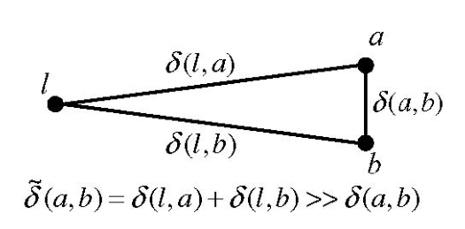
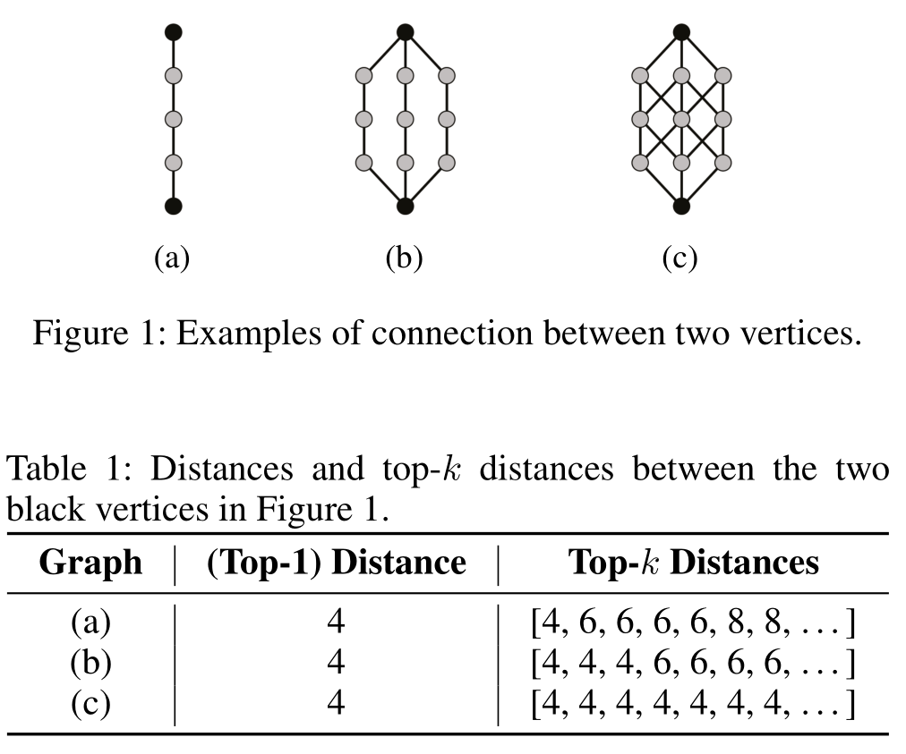

# Papers
## Fast Shortest Path Distance Estimation in Large Networks(CIKM-2009)
问题：图上最短路估计  
贡献：提出一个解决方法（基于 landmark）  

3.4 之前都是显而易见的东西，有时间认真看看后面的内容
### 应用/起源
web search(ranking/matching)  
social networks
### History -> state of art
Dijkstra/BFS  
combining bidirectional Dijkstra with A* and lower bounds (ALT algorithms)
### NP Hard
landmark-cover:选取最少的 landmarks，使得所有点对的询问都是正确的。  
vertex-cover:选取最少的节点，使得所有边被 cover。  

证明上面两个问题可以互相归约：对任一个 landmark-cover 的解，考虑最短路为 1 的点对，必须被 cover，所以这个解同时也是 vertex-cover 的解；对任一个 vertex-cover 的解，考虑任何点对之间的最短路，其上的边必然被覆盖，因此必有节点在此解中，从而也是 landmark-cover 的解。解等价因此最小解等价。

### Set Cover
每个节点对应所有最短路穿过他的点对集合，因此 Landmark-Cover 就变成 Set-Cover 问题，*A Greedy Heuristic for the Set-Covering Problem* 给出了一个贪心解法，$n^3$时间O(logn) 近似。
### Method
landmarks -> 三角形 -> bounds of distance  
唯一的操作点： landmarks 的选取策略。  
 * degree/h: 按 degree 降序，把当选点距离 h 之内的都删除。
 * centrality/h: 按到其余点距离和升序，点间距离不能小于 h。距离和采样估计。

实验中 h=1 最好。

文中也提到了分图后每个子图按度/中心程度/边界程度找一个点。边界程度指子图内部邻居数乘外部邻居数。

一个有趣的观察：上述策略在用上界估计时比随机好，但是用下界估计时随机更好。因为用边缘点估计下界更好？而上述策略找的都是集中点？

### Experiment
没见过的图统计指标：  
 * clustering coefficient：三角形\*3/(三角形\*3+三点两边数量)描述聚集程度。往往社交网络会比随机网络高。
 * parameter of Zipf distribution: 度数分布 $x^{-\theta}$，拟合一下这个 $\theta$
## Approximate Shortest Distance Computing: A Query-Dependent Local Landmark Scheme(IEEE-2012)
问题：图上最短路估计  
贡献：指出 landmark+三角定界的方法存在巨大的 relative error  

直观来讲，到这篇文章为止的 landmark 方法都是全局的，对 n^2 对点一视同仁(query-independent)，可能增加了 close pair 的 relative error(参考下图)，因此提出基于 SHORTEST PATH TREE 的局部方法。 这篇文章还有一些次要贡献（两个 indexing 技术）。

### Methods
SPT 上找 a,b 的 LCA, 记为 c,ac+bc 即为答案。局部 landmark 的意思是 landmark 不是全局那几个，而是与查询有关的，并不是指分图。

$O(N)-O(1)$ LCA $\rightarrow$ $\pm1$RMQ $\rightarrow$ log(N) 分块 ST 表，最小值不是求和，直接两边 $2^k$ 拼一下就行了。

indexing 技巧：later

## Dynamic and Historical Shortest-Path Distance Queries on Large Evolving Networks by Pruned Landmark Labeling(www-2014)
问题：动态图最短路精确计算
贡献：第一个大规模动态图上的方法

支持的操作：加点、加边。查询包括历史版本查询、change point 查询

### History -> SOA
exacty methods:
 * 2-hop cover -> pruned landmark labeling/IS-Label
 * tree decompositions
### Methods
Read later

## Efficient Top-k Shortest-Path Distance Queries on Large Networks by Pruned Landmark Labeling(AAAI-2015)
问题：top-k 最短路  
贡献：first indexing method to top-k distance inquiry.  
top-k 最短路能拿来衡量节点的连接紧密程度(看图)  

文章里用这个做了 link prediction
### Methods
Read later

## Fast exact shortest-path distance queries on large networks by pruned landmark labeling (SIGMOD-2013)(没看)
pruned landmark labeling

## Fast and Accurate Estimation of Shortest Paths in Large Graphs(CIKM-2010)
问题：最短路估计  
贡献：path-sketches, RDF-3X, give shortest paths with no computational overhead  
这文章提了一嘴社交网络特点：contain many high degree nodes, are nowhere close to planar, and typically have no hierarchical structures that can be exploited for improving shortest path queries. 
它说 path-sketches 包括了路径信息和 landmarks. 回头看看

是对 A Sketch-Based Distance Oracle for Web-Scale Graphs(WSDM-2010) 的改进
### Methods
Sketch: 随机采样 $r=\log n$ 个点集 $S_0,S_1,\dots,S_r, |S_i|=2^i$, 从集合 $S_i$ 开始 BFS 求出每个点到 $S_i$ 的最短距离和对应点，有向图是一来一回两个点 $l_1,l_2$（其中一个点要走逆向边 BFS）, 重复 k 次整个过程，对每个点可以得到 $2kr$ 个 Landmark，作为其 Sketch。由 $|S_0|=1$ 保证至少能从 sketch 找到一条最短路。

两个优化：
 * 消圈：同一个点在 s->v, v->t 上。
 * Shortcut：边 ww', w 在 sv 上，w' 在 vt 上。*Fast Fully Dynamic Landmark-based Estimation of Shortest Path Distances in Very Large Graphs(CIKM-11)* 在 Landmark SPT 上干了这个。

Tree Sketch: Later

## Fast Fully Dynamic Landmark-based Estimation of Shortest Path Distances in Very Large Graphs(CIKM-11)
问题：最短路估计  
贡献：把 landmark 要记的东西改成 SPT

他说 SPT 支持动态删改(?)，自然就变成动态方法了。次要贡献：提出又一种 landmark 选取策略。

这和 local landmark 那篇有什么区别？
### Methods
read later

## Fully Dynamic Shortest-Path Distance Query Acceleration on Massive Networks(CIKM-16)
问题：图最短路  
贡献：billion-scale dynamic  

## Related Work
它说动态图方法里面 Approximate Shortest Distance Computing: A Query-Dependent Local Landmark Scheme 只能勉强 million-scale，Fast Fully Dynamic Landmark-based Estimation of Shortest Path Distances in Very Large Graphs 不是精确。而它是 dynamic billion-scale

### Methods
Bidirectional BFS, Bit-Parallel SPT  
Details later

## Landmark Indexing for Evaluation of Label-Constrained Reachability Queries(SIGMOD-17)
问题：label-constrained reachability(LCR), 边有标签，询问只经过一部分标签的边st是否可达  
贡献：

### 应用/起源
regular path queries: 标签就是字符，正则表达式 $(l_1\cup l_2\cup \dots \cup l_n)^*$

### History -> SOA
LCR 最早是 Computing label-constraint reachability in graph databases.(SIGMOD-2010) 这篇，本文 idea 继承自这里

LCSP (label-constrained shortest path) Distance oracles in edge-labeled graphs. 这个是估计方法，因此对可达性无用

SOA 是 Efficient processing of label-constraint reachability queries in large graphs. 这篇是拆 SCC 做的，SCC 很大或者桥很多就不行了。

### Methods
Balance between BFS and precomputed TC(transitive closure)
Details Later

