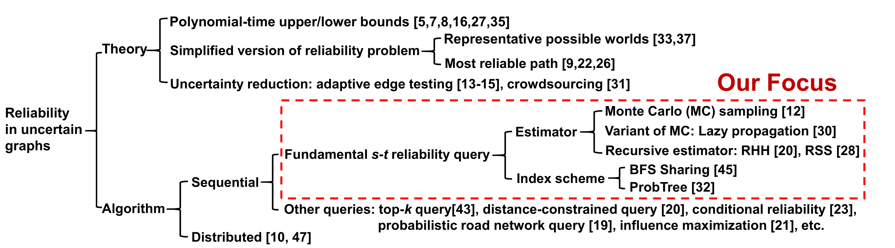

## An In-Depth Comparison of s-t Reliability Algorithms over Uncertain Graphs(2019)
问题：在 uncertain graph 里估计 s-t 的可达概率，本文模型是每条边有互相独立的表示是否连接的概率。  
贡献：总结 6 个 SOA 方法，放在同样的条件下对比，基于 accuracy/varience/memory cost/time cost 对它们做出充分全面的对比。  
拓展：分布式方法、其他形式的 s-t 可达概率、reduction of uncertainty before estimating s-t reliability、top-k query...
  
### 应用/起源
quality of connections between devices in device network  
social/biological network  
predict probability of protein-protein interaction  
discover reliable peers in P2P transfer  
infomation diffusion in social network(estimate number of infected people)
### Methods
Read later

## Distance-Constraint Reachability Computation in Uncertain Graphs(VLDB-2011)
问题：distance-constraint reachability (DCR), 在不确定图里给定距离限制问 s-t 可达概率
贡献：提出这个问题，并给了一种方法

### 应用/起源
P2P 网络中，只寻找一定距离内的 peer，否则造成 congestion(拥塞)  
交通网络同理  
社交网络中更倾向于 trust hop 少的人（这一点我觉得他在扯淡，强行写进来当应用场景）
### Methods
Later

## Efficient Network Reliability Computation in Uncertain Graphs(2019)
问题：s-t 的可达概率
贡献：用分层抽样减少采样数量，给了更紧的上下界？our approach is the first solution to achieve both high efficiency and accuracy to compute the network reliability

文章把方法叫做 $S^2BDD$ scalable and sampling binary decision diagram

### Methods
Later

## Recursive Stratified Sampling: A New Framework for Query Evaluation on Uncertain Graphs(TKDE-2015)
问题：s-t 可达概率
贡献：RSS(Recursive Stratified Sampling),主要是降低 variance

### Methods
Later

## Scalable Influence Maximization for Prevalent Viral Marketing in Large-Scale Social Networks(SIGKDD-2010)
问题：影响力最大化
贡献：又快又好

### Methods
每个点搞个最大概率路径树，边是从叶子指向根的，概率大于阈值的不考虑。递归可算 $S$ 对根 $v$ 的影响概率（里面有容斥）。把所有 $v$ 的概率加起来就能算 $S$ 的影响期望。  
加速：树上某个点加到 $S$ 的时候，求新集合激活根的概率，只要走一遍树就能全部求出每个点的影响。具体之后再说