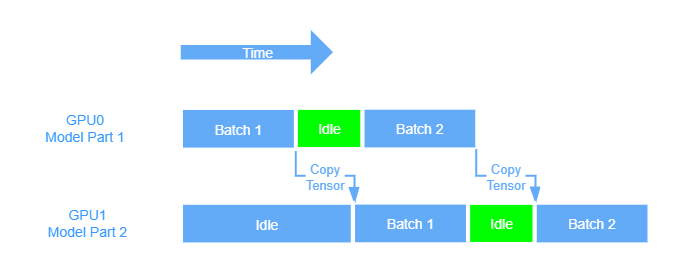
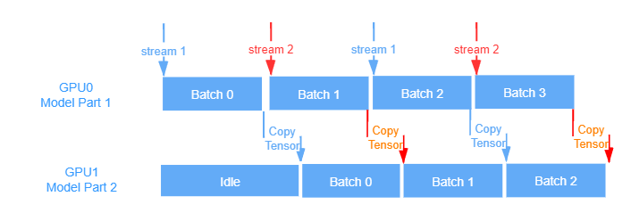

## 分布式多进程
[单机多卡最佳实践](https://pytorch.org/tutorials/intermediate/model_parallel_tutorial.html)。DDP 教程在[这里](https://pytorch.org/tutorials/intermediate/ddp_tutorial.html)。用分布式多进程做 ImageNet+ResNet 训练有[官方样例](https://github.com/pytorch/examples/blob/master/imagenet/main.py)，但官方样例的 test 没做分布式 [issue#461](https://github.com/pytorch/examples/issues/461)，我把它改成了分布式([代码](https://github.com/triomino/examples/blob/master/imagenet/main.py))。但这个终究还是 Model Sharing，不够过瘾。

### 理想和现实的距离
虽然下面分析看上去 model parallel 很厉害，但是理想和现实有一定距离。
实际情况难以保证 model 分割平均，两个卡总是不平均。一个卡能到 80% 负荷，另一个只有 60%, 不如 model share 所有卡都能跑满(200%)，不过同 batch_size 080+60 接近 200 的训练速度很厉害。另外 split_size 得是 16/32 这种，比如 120:20 会慢于 96:16，可能是底层的优化问题。而且不管怎么调，负荷高的卡总是难以达到 100%，如果解决这个问题，应该速度能更快。

### model parallel 比 model share 更快。
model parallel=data streaming 指模型分割。
model share=data parallel 只是数据分割，所有 GPU 共享同样的 model 参数。也就是 DataParallel 和 DistributedDataParallel 做的事情。
尽量用 DistributedDataParallel，DDP 多进程，DP 多线程。DistributedDataParallel 还有个好处是可以
和 model parallel 融合。
model parallel 具有更高的编程复杂度，但是感觉会很爽，理想目标是有几个 GPU 就加速几倍。model parallel 让交流的耗损尽量小，尽可能的在靠近这个目标。

为什么 model parallel 比 model share 更快？从原理上猜测原因：
 * batch size 可以设的更大。Model Sharing 每个卡都是整个 model，batch_size 太大就爆显存了。
 * 数据是串流传递，交流成本是 2 个模型规模，次数 2(n-1)，因为有正反。model sharing 会在所有卡上同步数据，如果是选一个 master 来同步，至少是 2(n-1)*整个模型的交流成本，而且 DDP 一个周期里有三个同步点。另外，设 master 会导致 master 在拷贝的时候遭遇瓶颈。
### model parallel and pipeline
**这部分分析完全没有考虑 backward.**

我们把 model 按层分割成两部分，那么单个 GPU 训练过程如下图：
  
[这里](https://pytorch.org/tutorials/intermediate/model_parallel_tutorial.html) 给了双 GPU pipeline 的例子.  
数据 stream 从 GPU0 输入，输出送到 GPU1，这样把 GPU 串联起来。batch1 在 GPU1 上跑第二层的时候，batch2 可以进 GPU0 跑第一层了。这样就并行了起来，pytorch 调度 CUDA 是异步的，所以不用写多线程代码。图示：  
  

这里会有额外时间耗费，比如从 GPU0 copy 到 GPU1，拷贝需要时间. 同时，如果只有一个 stream，那你在 copy 到 GPU1 的时候 GPU0 是不能动的，因为拷贝是同步函数，这时 GPU0 空闲，就是上面绿色的地方。

事实上这两个过程可以同时进行，冲突仅仅是因为我们只有一个 stream。如果开两个 stream，在 batch0 拷贝的时候，stream2 可以开始算 batch1，然后 steam2 拷贝 batch1 的时候，第一个 stream 可以开始算 batch2，这样交错就减少了空闲时间，上图的绿色部分就能压调了. 参考下图：  

另外，一般拷贝比计算快得多，所以两个 stream 就够了，如果拷贝比计算慢，stream 可以更多，取决于两者的比值。一般情况下 validation 会出现这种情况，拷贝数据比计算远远要慢。

由于拷贝是同步的，所以要开 multiprocessing 同时进行两个拷贝过程. 以上这些都要自己手编，没有现成模块。
### DDP 原理
在 constructor, forward 和 backward 分别有一个同步点，把所有计算后的参数同步(reduce)。
### DDP 和 save/load
假设我们的进程开始会 load，结束要 save. 显然应该只在一个 process 上写，其他同步。可以用 distributed.barrier() 保证读写的安全性。此外，根据[读写教程](https://pytorch.org/tutorials/beginner/saving_loading_models.html)，如果存的时候没有 model.module.state_dict() 中的 module，可能写入会带 device 信息，[DDP教程](https://pytorch.org/tutorials/intermediate/ddp_tutorial.html)里给的代码是在 load 的时候用 map_location 把 cuda0 变成 cudax. 我觉得两个应该都行，如果带不带 module 的区别仅仅是 device 信息有无。其实这是小问题，如果你有洁癖，直接自己规定什么东西要 save，像 [imagenet 样例程序](https://github.com/pytorch/examples/blob/master/imagenet/main.py) 一样
### DDP 和 model parallel 融合
比如启动四个 process，每个 process 把 model 分割成两个，一共要用 8 个 GPU.
0,2,4,6 同步前半个 model 的参数，1,3,5,7 同步后半个。 stream 来的时候分四流0->1,2->3,4->5,6->7，为了节约拷贝时间可以分八流，两两交错。在[DDP教程](https://pytorch.org/tutorials/intermediate/ddp_tutorial.html)最后一节有一个简单例子。这可能就是极致的并行。有空玩一玩这个，看上去非常酷炫。
### 问题
怎么找分割点？我猜可以实验看时间。这样 forward 和 backward 还得分开搞，不是很麻烦？   
为什么教程是 batch 里 split，直接 batch 并行不好吗。难道他们的模型巨大，单批数据不得不小？还是 batch 会有硬盘 io 瓶颈什么的？写写代码就知道了。。。因为 batch 有 backward，你还要考虑回传，难以并行。  
backward 是怎么回事，dout 回传是不是也有 device to device 的 cost？
### 其他链接
[DDP 内部实现](https://pytorch.org/docs/stable/notes/ddp.html#ddp)  
[DDP 接口文档](https://pytorch.org/docs/stable/nn.html#torch.nn.parallel.DistributedDataParallel)